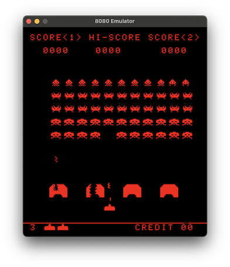

# 8080 Emulator

This is a simple emulator for the Intel 8080 microprocessor. It is written in C++ and uses the SDL2 library for graphics and input.

Currently, the emulator is able to run Space Invaders only. The ROM for Space Invaders is not included in this repository, but can be found online.

<center>

</center>

## Prepare the ROM

To run the emulator, you will need to provide the ROM for Space Invaders. Download the following files:

- invaders.h
- invaders.g
- invaders.f
- invaders.e

Then concatenate them into a single file:

```bash
cat invaders.h invaders.g invaders.f invaders.e > invaders
```

Put the `invaders` file in a directory called `space-invaders` in the root of the repository.

```bash
mkdir space-invaders
mv invaders space-invaders
```

## Build

On MacOS you can install `sdl2` using Homebrew:

```bash
brew install sdl2
```

Then you can build the emulator:

```bash
./make.sh
```

OR

```bash
./make_debug.sh
```

## Run

To run the emulator:

```bash
./emulator
```
